The Kolmogorov-Smirnov Test
===========================

.. toctree::
   :maxdepth: 2

A visit to a data and statistical technique useful to software engineers. We
learn about some Rust too along the way.

The code and examples here are available on
`Github <https://github.com/daithiocrualaoich/kolmogorov_smirnov>`_. The Rust
library is on `crates.io <https://crates.io/crates/kolmogorov_smirnov>`_.


Kolmogorov-Smirnov Hypothesis Testing
-------------------------------------
The Kolmogorov-Smirnov test is a hypothesis test procedure for determining if
two samples of data are from the same distribution. The test is non-parametric
and entirely agnostic to what this distribution actually is. The fact that we
never have to know the distribution the samples come from is incredibly useful,
especially in software and operations where the distributions are hard to
express and difficult to calculate with.

It is really surprising that such a useful test exists. This is an unkind
Universe, we should be completely on our own.

The test description may look a bit hard in the outline below but skip ahead to
the implementation because the Kolmogorov-Smirnov test is incredibly easy in
practice.

The Kolmogorov-Smirnov test is covered in `Numerical Recipes`_. There is a
`pdf <http://www.aip.de/groups/soe/local/numres/bookcpdf/c14-3.pdf>`_ available
from the third edition of Numerical Recipes in C.

.. _Numerical Recipes: http://www.aip.de/groups/soe/local/numres

The `Wikipedia article <https://en.wikipedia.org/wiki/Kolmogorov%E2%80%93Smirnov_test>`_
is a useful overview but light about proof details. If you are interested in
why the test statistic has a distribution that is independent and useful for
constructing the test then these
`MIT lecture notes <http://ocw.mit.edu/courses/mathematics/18-443-statistics-for-applications-fall-2006/lecture-notes/lecture14.pdf>`_
give a sketch overview.

See this `introductory talk <https://vimeo.com/95069158>`_ by Toufic Boubez at
Monitorama for an application of the Kolmogorov-Smirnov test to metrics and
monitoring in software operations. The slides are available on
`slideshare <http://www.slideshare.net/tboubez/simple-math-for-anomaly-detection-toufic-boubez-metafor-software-monitorama-pdx-20140505>`_.

The Test Statistic
~~~~~~~~~~~~~~~~~~
The Kolmogorov-Smirnov test is constructed as a statistical hypothesis test. We
determine a null hypothesis, :math:`H_0`, that the two samples we are testing
come from the same distribution. Then we search for evidence that this
hypothesis should be rejected and express this in terms of a probability. If
the likelihood of the samples being from different distributions exceeds a
confidence level we demand the original hypothesis is rejected in favour of the
hypothesis, :math:`H_1`, that the two samples are from different distributions.

To do this we devise a single number calculated from the samples, i.e. a
statistic. The trick is to find a statistic which has a range of values that do
not depend on things we do not know. Like the actual underlying distributions in
this case.

The test statistic in the Kolmogorov-Smirnov test is very easy, it is just the
maximum vertical distance between the empirical cumulative distribution
functions of the two samples. The empirical cumulative distribution of a sample
is the proportion of the sample values that are less than or equal to a given
value.

For instance, in this plot of the empirical cumulative distribution functions
of normally distributed data, :math:`N(0, 1)` and :math:`N(0, 2)` samples, the
maximum vertical distance between the lines is at about -1.5 and 1.5.

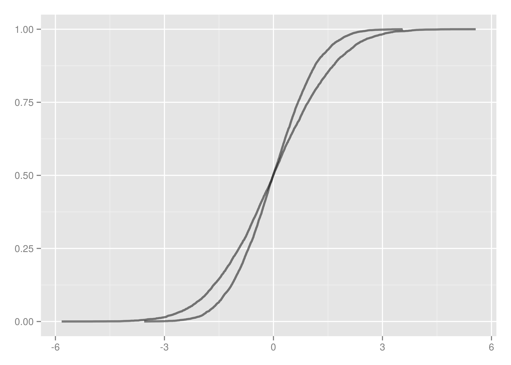

The vertical distance is a lot clearer for an :math:`N(0, 1)` sample against
:math:`N(1, 1)`. The maximum vertical distance occurs somewhere around zero and
is quite large, maybe about 0.35 in size. This is significant evidence that the
two samples are from different distributions.

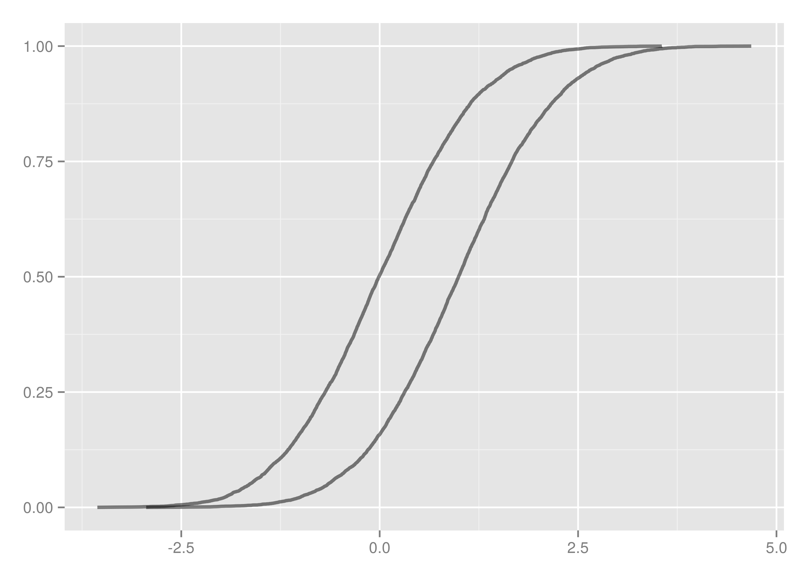

As an aside, these examples demonstrate an important note about the application
of the Kolomogorov-Smirnov test. It is much better at detecting distributional
differences when the sample medians are far apart than it is at detecting
when the tails are different but the main mass of the distributions is around
the same values.

So, more formally, suppose :math:`X_i` are n independent and identically
distributed observations of a continuous value. The empirical cumulative
distribution function, :math:`F_n`, is:

.. math::

    F_n(x) = \frac{1}{n}\sum_{i=1}^n I_{(-\infty,x]}(X_i)

Where :math:`I` is the indicator function which is 1 if :math:`X_i` is less than
or equal to :math:`x` and 0 otherwise.

This just says that :math:`F_n(x)` is the number of samples observed that are
less than or equal to :math:`x` divided by the total number of samples. But it
says it in a complicated way so we can feel clever about ourselves.

The empirical cumulative distribution function is an unbiased estimator for the
underlying cumulative distribution function, incidentally.

For two samples having empirical cumulative distribution functions
:math:`F_n(x)` and :math:`G_m(x)`, the Kolmogorov-Smirnov test statistic,
:math:`D`, is the maximum absolute difference between :math:`F_n(x)` and
:math:`G_m(x)` for the same :math:`x`,  i.e. the largest vertical distance
between the plots in the graph.

.. math::

    D = \sup_{-\infty < x < \infty} |F_n(x) - G_m(x)|

The Glivenko–Cantelli theorem says if the :math:`F_n(x)` is made from samples
from the same distribution as :math:`G_m(x)` then this statistic "almost surely
converges to zero in the limit when n goes to infinity." This is an extremely
technical statement that we are simply going to ignore.

Two Sample Test
~~~~~~~~~~~~~~~
Surprisingly, the distribution of :math:`D` can be approximated well in the case
that the samples are drawn from the same distribution. This means we can build
a statistic test that rejects this null hypothesis for a given confidence level
if :math:`D` exceeds an easily calculable value.

Tables of critical values are available, for instance the `SOEST tables`_
describe a test implementation for samples of more than twelve where we reject
the null hypothesis, i.e. decide that the samples are from different
distributions, if:

.. math::

    D > c(\alpha)\sqrt{\frac{n + m}{n m}}

Where n and m are the sample sizes. A 95% confidence level corresponds to
:math:`\alpha = 0.05` for which :math:`c(\alpha) = 1.36`.

.. _SOEST tables: https://www.webdepot.umontreal.ca/Usagers/angers/MonDepotPublic/STT3500H10/Critical_KS.pdf

Alternatively, Numerical Recipes describes a direct calculation that works well
for:

.. math::

    N_{n, m} = \frac{n m}{n + m} \geq 4

i.e. for samples of more than seven since :math:`N_{8, 8} = 4`.

Numerical Recipes continues by claiming the probability that the test statistic
is greater than the value observed is approximately:

.. math::

    P(D > \text{observed}) = Q_{KS}\Big(\Big[\sqrt{N_{n, m}} + 0.12 + 0.11/\sqrt{N_{n, m}}\Big] D\Big)

With :math:`Q_{KS}` defined as:

.. math::

    Q_{KS}(x) = 2 \sum_{j=1}^{\infty} (-1)^{j-1} e^{-2j^2x^2}

This can be computed by summing terms until a convergence criteria is achieved.
The implementation in Numerical Recipes gives this a hundred terms to converge
before failing.

The difference between the two approximations is marginal. The Numerical
Recipes approach produces slightly smaller critical values for rejecting the
null hypothesis as can be seen in the following plot of critical values for the
95% confidence level where one of the samples has size 256. The x axis varies
over the other sample size, the y axis being the critical value.

.. image:: images/critical-values-1.png

The SOEST tables are an excellent simplifying approximation.

Discussion
~~~~~~~~~~
A straightforward implementation of this test can be found in the
`Github repository <https://github.com/daithiocrualaoich/kolmogorov_smirnov>`_.
Calculating the test statistic using the empirical cumulative distribution
functions is probably as complicated as it gets for this. There are two versions
of the test statistic calculation in the code, the simpler version being used to
probabilistically verify the more efficient implementation.

Non-parametricity and generality are the great advantages of the
Kolomogorov-Smirnov test but these are balanced by drawbacks in ability to
establish sufficient evidence to reject the null hypothesis.

In particular, the Kolmogorov-Smirnov test is weak in cases when the sample
empirical cumulative distribution functions do not deviate strongly even though
the samples are from different distributions. For instance, the
Kolomogorov-Smirnov test is most sensitive to discrepency near the median of the
samples because this is where differences in the graph are most likely to be
large. It is less strong near the tails because the cumulative distribution
functions will both be near 0 or 1 and the difference between them less
pronounced. Location and shape related scenarios that constrain the :math:`D`
test statistic reduce the ability of the Kolmogorov-Smirnov test to correctly
reject the null hypothesis.

The Chi-squared test is also used for testing whether samples are from the same
distribution but this is done with a binning discretization of the data. The
Kolomogorov-Smirnov test does not require this.


A Field Manual for Rust
-----------------------
`Rust`_ is a Mozilla sponsored project to create a safe, fast systems language.
There is an entire free
`O'Reilly book <http://www.oreilly.com/programming/free/files/why-rust.pdf>`_
on why create this new language but the reasons include:

* Robust memory management. It is impossible to deference null or dangling
  pointers in Rust.
* Improved security, reducing the incidence of flaws like buffer overflow
  exploits.
* A light runtime with no garbage collection and overhead means Rust is
  ideal to embed in other languages and platforms like Ruby, Python, and Node.
* Rust has many modern language features unavailable in other systems languages.

.. _Rust: https://www.rust-lang.org

Rust is a serious language, capable of very serious projects. The current
flagship Rust project, for instance, is `Servo`_, a browser engine under open
source development with contributions from Mozilla and Samsung.

.. _Servo: https://servo.org

The best introduction to Rust is the `Rust Book`_. Newcomers should also read
Steve Klabnik's `alternative introdution to Rust`_ for the upfront no-nonsense
dive into memory ownership, the crux concept for Rust beginners.

.. _Rust Book: https://doc.rust-lang.org/book
.. _alternative introdution to Rust: http://words.steveklabnik.com/a-new-introduction-to-rust

Those in a hurry can quickstart with these slide decks by:

* `Dimiter Petrov and Romain Ruetschi <http://hackepfl.github.io/rust-workshop-slides/slides.html>`_
* `Danilo Bargen <https://speakerdeck.com/dbrgn/intro-to-rust>`_

Two must-read learning resources are `24 Days of Rust`_, a charming tour around
the libraries and world of Rust, and `ArcadeRS`_, a tutorial in Rust about
writing video games.

.. _24 Days of Rust: http://zsiciarz.github.io/24daysofrust
.. _ArcadeRS: http://jadpole.github.io/arcaders/arcaders-1-0

And finally, if Servo has you interested in writing a browser engine in Rust,
then `Let's build a browser engine!`_ is the series for you. It walks through
creating a simple HTML rendering engine in Rust.

.. _Let's build a browser engine!: http://limpet.net/mbrubeck/2014/08/08/toy-layout-engine-1.html

Moral Support for Learning the Memory Rules
~~~~~~~~~~~~~~~~~~~~~~~~~~~~~~~~~~~~~~~~~~~
The Road to Rust is not royal, there is no pretending otherwise. The Rust memory
rules about lifetime, ownership, and borrowing are especially hard to learn.

It probably doesn't much feel like it but Rust is really trying to help us with
these rules. And to be fair to Rust, it hasn't segfaulted me so far.

But that is no comfort when the compiler won't build your code and you can't
figure out why. The best advice is probably to read as much about the Rust
memory rules as you can and to keep reading about them over and over until they
start to make some sense. Don't worry, everybody finds it difficult at first.

Although adherence to the rules provides the compiler with invariant guarantees
that can be used to construct proofs of memory safety, the rationale for these
rules is largely unimportant. What is necessary is to find a way to work with
them so your programs compile.

Remember too that learning to manage memory safely in C/C++ is much harder than
learning Rust and there is no compiler checking up on you in C/C++ to make sure
your memory management is correct.

Keep at it. It takes a long time but it does become clearer!

Niche Observations
~~~~~~~~~~~~~~~~~~
This section is a scattering of Rust arcana that caught my attention. Nothing
here that doesn't interest you is worth troubling too much with and you should
skip on past.

`Travis CI`_ has excellent support for building Rust projects, including with
the beta and nightly versions. It is simple to set up by configuring a
``travis.yml`` according to the
`Travis Rust documentation <https://docs.travis-ci.com/user/languages/rust>`_.
See the `Travis CI build for this project`_ for an example.

.. _Travis CI: https://travis-ci.org
.. _Travis CI build for this project: https://travis-ci.org/daithiocrualaoich/kolmogorov_smirnov

Rust has a formatter in `rustfmt`_ and a lint in `rust-clippy`_. The formatter
is a simple install using ``cargo install`` and provides a binary command. The
lint requires more integration into your project, and currently also needs the
nightly version of Rust for plugin support. Both projects are great for helping
Rust newcomers.

.. _rustfmt: https://github.com/rust-lang-nursery/rustfmt
.. _rust-clippy: https://github.com/Manishearth/rust-clippy

Foreign Function Interface is an area where Rust excels. The absence of a large
runtime means Rust is great for embedding in other languages and it has a wide
range as a C replacement in writing modules for Python, Ruby, Node, etc. The
`Rust Book introduction <https://doc.rust-lang.org/book/rust-inside-other-languages.html>`_
demonstrates how easy it is call Rust from other languages.
`Day 23 of Rust <https://zsiciarz.github.io/24daysofrust/book/day23.html>`_ and
the `Rust FFI Omnibus`_ are additional resources for Rust FFI.

.. _Rust FFI Omnibus: http://jakegoulding.com/rust-ffi-omnibus

Rust is being used experimentally for embedded development. `Zinc`_ is work on
building a realtime ARM operating system using Rust primarily, and the following
are posts about building software for embedded devices directly using Rust.

* `Rust bare metal on ARM microcontroller`_.
* `Embedded Rust Right Now!`_

.. _Zinc: http://zinc.rs
.. _Rust bare metal on ARM microcontroller: http://antoinealb.net/programming/2015/05/01/rust-on-arm-microcontroller.html
.. _Embedded Rust Right Now!: http://spin.atomicobject.com/2015/02/20/rust-language-c-embedded

Relatedly, `Rust on Raspberry Pi`_ is a guide to cross-compiling Rust code for
the Raspberry Pi.

.. _Rust on Raspberry Pi: https://github.com/Ogeon/rust-on-raspberry-pi/

Rust treats the code snippets in your project documentation as tests and makes a
point of compiling them. This helps keep documentation in sync with code but it
is a shock the first time you get a compiler error for a documentation code
snippet and it takes you ages to realise what is happening.


Kolmogorov-Smirnov Library
--------------------------
The Kolmogorov-Smirnov test implementation is available as a Cargo
`crate <https://crates.io/crates/kolmogorov_smirnov/>`_, so it is simple to
incorporate into your programs. Add the dependency to your ``Cargo.toml`` file.

::

    [dependencies]
    kolmogorov_smirnov = "1.0.1"

Then to use the test, call the ``kolmogorov_smirnov::test`` function with the
two samples to compare and the desired confidence level.

.. sourcecode:: rust

    extern crate kolmogorov_smirnov as ks;

    let xs = vec!(0, 1, 2, 3, 4, 5, 6, 7, 8, 9, 10, 11, 12);
    let ys = vec!(12, 11, 10, 9, 8, 7, 6, 5, 4, 3, 2, 1, 0);
    let confidence = 0.95;

    let result = ks::test(&xs, &ys, confidence);

    if !result.is_rejected {
        // Woot! Samples are from the same distribution with 0.95 confidence.
    }

The Kolmogorov-Smirnov test as implemented works for any data with a ``Clone``
and an ``Ord`` trait implementation in Rust. So it is possible, but pretty
useless, to test samples of characters, strings and lists. In truth, the
Kolmorogov-Smirnov test requires the samples to be taken from a continuous
distribution, so discrete data like characters and strings are cute to consider
but invalid test data.

Still being strict, this test condition also does not hold for integer data
unless some hands are waved about the integer data being embedded into 
real numbers and a distribution cooked up from the probability weights. We make
some compromises and allowances.

If you have floating point or integer data to test, you can use the included
test runner binaries, ``ks_f64`` and ``ks_i32``. These operate on single-column
headerless data files and test two commandline argument filenames against each
other at 95% confidence.

::

    $ cargo run -q --bin ks_f64 dat/normal_0_1.tsv dat/normal_0_1.1.tsv
    Samples are from the same distribution.
    test statistic = 0.0399169921875
    critical value = 0.08550809323787689
    reject probability = 0.18365715210599798

    $ cargo run -q --bin ks_f64 dat/normal_0_1.tsv dat/normal_1_1.1.tsv
    Samples are from different distribution.
    test statistic = 0.361572265625
    critical value = 0.08550809323787689
    reject probability = 1

Testing floating point numbers is a headache because Rust floating point types
(correctly) do not implement the ``Ord`` trait, only the ``PartialOrd`` trait.
This is because things like ``NaN`` are not comparable and the order cannot be
total over all values in the datatype.

The test runner for floating point types is implemented using a wrapper type
that implements a total order, crashing on unorderable elements. This suffices
in practice since the unorderable elements will break the test anyway.

The implementation uses the Numerical Recipes approximation for rejection
probabilities rather than the almost as accurate SOEST table approximation for
critical values. This allows the additional reporting of the reject probability
which isn't available using the SOEST approach.


Datasets
--------
Statistical tests are more fun if you have datasets to run them over.

N(0,1)
~~~~~~
Because it is traditional and because it is easy and flexible, start with some
normally distributed data.

Rust can generate normal data using the `rand::distributions`_ module. If
``mean`` and ``variance`` are ``f64`` values representing the mean and variance
of the desired normal deviate, then the following code generates the deviate.
Note that the ``Normal::new`` call requires the mean and standard deviation as
parameters, so it is necessary to take the square root of the variance to
provide the standard deviation value.

.. _`rand::distributions`: https://doc.rust-lang.org/rand/rand/distributions/

.. sourcecode:: rust

    extern crate rand;
    use rand::distributions::{Normal, IndependentSample};

    let mean: f64 = ...
    let variance: f64 = ...

    let mut rng = rand::thread_rng();
    let normal = Normal::new(mean, variance.sqrt());

    let x = normal.ind_sample(&mut rng);

The ``kolmogorov_smirnov`` library includes a binary for generating sequences of
independently distributed Normal deviates. It has the following usage.

::

    cargo run --bin normal <num_deviates> <mean> <variance>

The ``-q`` option is useful too for suppressing ``cargo`` build messages in the
output.

Sequences from :math:`N(0, 1)`, :math:`N(0, 2)`, and :math:`N(1, 1)` are
included in the
`Github repository <https://github.com/daithiocrualaoich/kolmogorov_smirnov>`_.
:math:`N(0, 2)` is included mainly just to troll, calculating :math:`\sqrt{2}`
and drawing attention to the limitations of the floating point represention of
irrational numbers.

.. sourcecode:: bash

    cargo run -q --bin normal 8192 0 1 > normal_0_1.tsv
    cargo run -q --bin normal 8192 0 2 > normal_0_2.tsv
    cargo run -q --bin normal 8192 1 1 > normal_1_1.tsv

These are not the most beautiful of Normal curves, but you must take what you
get. The :math:`N(0, 1)` data is lumpy and not single peaked.

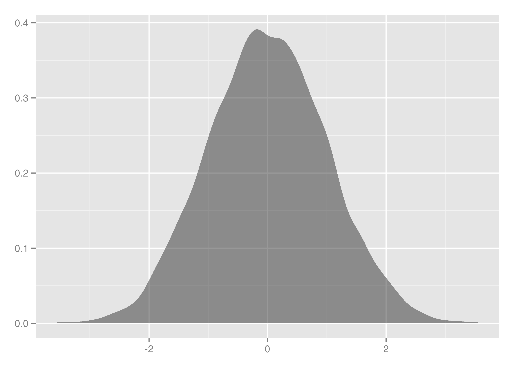

:math:`N(0, 2)` is similar, though less of a disaster near the mean.

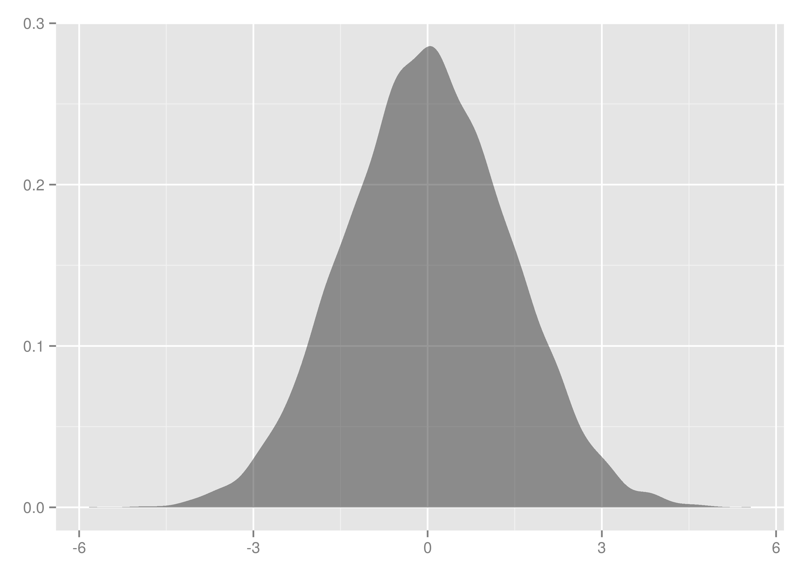

:math:`N(1, 1)` by contrast looks suprisingly like the normal data diagrams in
textbooks.

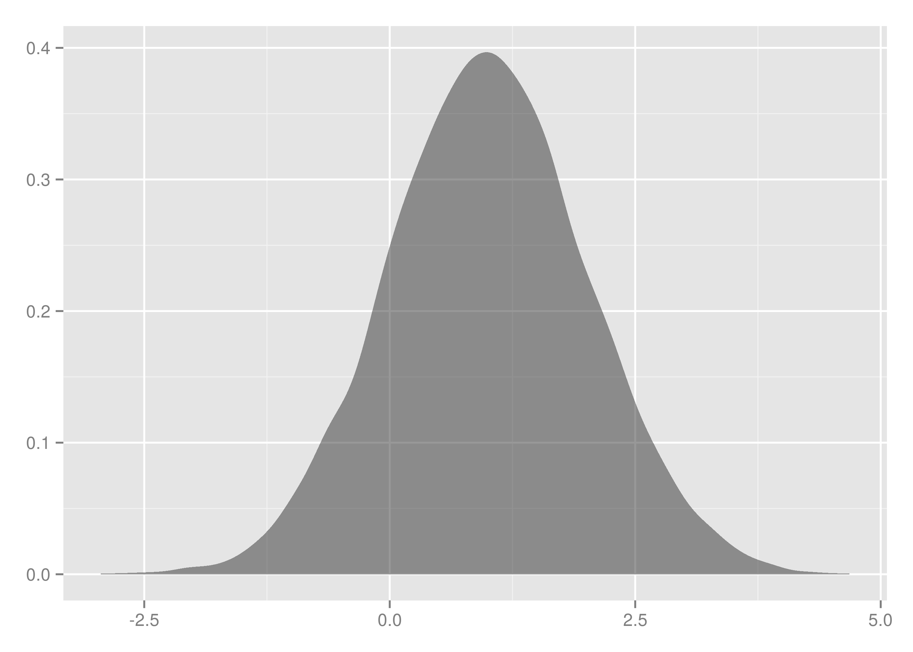

The following is a plot of all three datasets to illustrate the relative widths,
heights and supports.

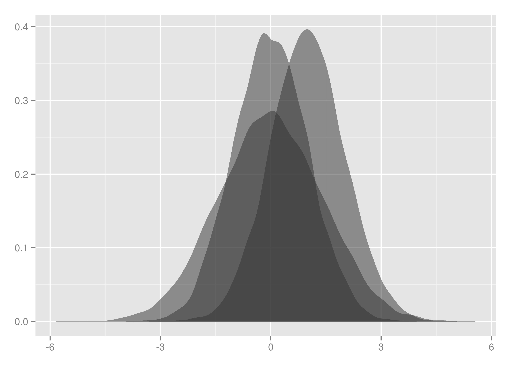

Results
```````
The Kolmogorov-Smirnov test is successful at establishing the :math:`N(0, 1)`
datasets are all from the same distribution in all combinations of the test.

::

    $ cargo run -q --bin ks_f64 dat/normal_0_1.tsv dat/normal_0_1.1.tsv
    Samples are from the same distribution.
    test statistic = 0.0399169921875
    critical value = 0.08550809323787689
    reject probability = 0.18365715210599798

    $ cargo run -q --bin ks_f64 dat/normal_0_1.tsv dat/normal_0_1.2.tsv
    Samples are from the same distribution.
    test statistic = 0.0595703125
    critical value = 0.08550809323787689
    reject probability = 0.6677483327196572

    ...

Save yourself the trouble in reproduction by running this instead:

.. sourcecode:: bash

    for I in dat/normal_0_1.*
    do
        for J in dat/normal_0_1.*
        do
            if [[ "$I" < "$J" ]]
            then
                echo $I $J
                cargo run -q --bin ks_f64 $I $J
                echo
                echo
            fi
        done
    done

The :math:`N(1, 1)` datasets also correctly accept the null hypothesis in all
combinations of dataset inputs when tested against each other.

However, :math:`N(0, 2)` successfully passes for all combinations but that
between ``dat/normal_0_2.tsv`` and ``dat/normal_0_2.1.tsv`` where it fails as a
false negative.

::

    $ cargo run -q --bin ks_f64 dat/normal_0_2.1.tsv dat/normal_0_2.tsv
    Samples are from different distributions.
    test statistic = 0.102783203125
    critical value = 0.08550809323787689
    reject probability = 0.9903113063475989

This failure is a demonstration of how the Kolmogorov-Smirnov test is sensitive
to location because here the mean of the ``dat/normal_0_2.1.tsv`` is shifted
quite far from the origin.

This is the density.

.. image:: images/n021-1.png

And superimposed with the density from ``dat/normal_0_2.tsv``.

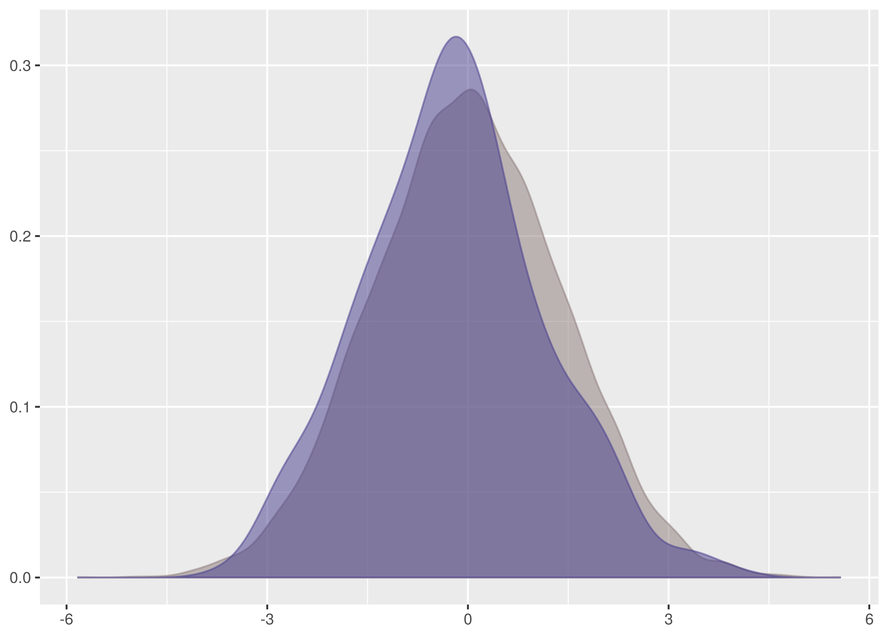

The data for ``dat/normal_0_2.1.tsv`` is the taller density in this graph.
Notice, in particular, that the mean is shifted left a lot in comparison with
``dat/normal_0_2.tsv``. See also the chunks of non-overlapping weight on the
left and right hand slopes.

The difference in means is confirmed by calculation. The dataset for
``dat/normal_0_2.tsv`` has mean 0.001973723, whereas the dataset for
``dat/normal_0_2.1.tsv`` has mean -0.2145779. By comparison, the other
:math:`N(0, 2)` datasets tests have means -0.1308625, -0.08537648, and
-0.01374325.

Looking at the empirical cumulative density functions of the false negative
comparison, we see a significant gap between the curves starting near 0.

.. image:: images/n02n021ecdf-1.png

For comparison, here are the overlaid empirical cumulative density functions
for the other :math:`N(0, 2)` tests.

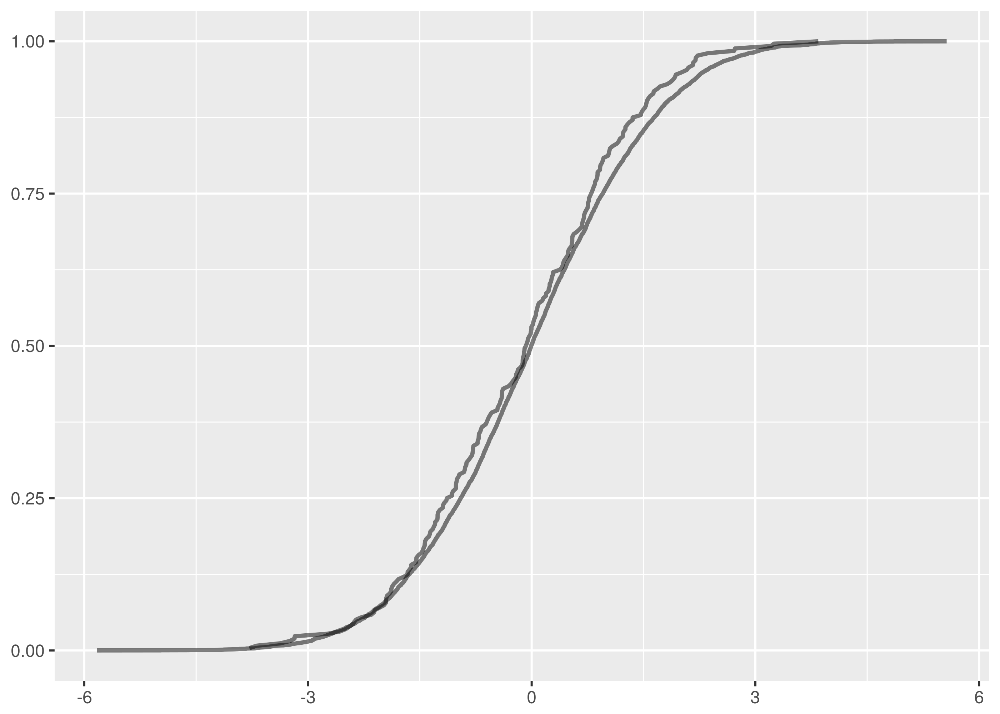
.. image:: images/n02n023ecdf-1.png
.. image:: images/n02n024ecdf-1.png

One false negative in thirty unique test pairs at 95% confidence is on the
successful side of expectations.

Turning instead to tests that should be expected to fail, the following block
runs comparisons between datasets from different distributions.

.. sourcecode:: bash

    for I in dat/normal_0_1.*
    do
        for J in dat/normal_0_2.*
        do
            echo $I $J
            cargo run -q --bin ks_f64 $I $J
            echo
            echo
        done
    done

The :math:`N(0, 1)` against :math:`N(1, 1)` and :math:`N(0, 2)` against
:math:`N(1, 1)` tests correctly reject the null hypothesis in every variation.
These tests are easy failures because they are large location changes,
illustrating again how the Kolmogorov-Smirnov test is sensitive to changes in
centrally located weight.

However, there are ten false positives in the comparisons between datasets from
:math:`N(0, 1)` and :math:`N(0, 2)`.

``dat/normal_0_1.2.tsv`` is reported incorrectly as being from the same
distribution as the following datasets.

* ``dat/normal_0_2.tsv`` at :math:`P(\text{reject } H_0) = 0.9375`,
* ``dat/normal_0_2.2.tsv`` at :math:`P(\text{reject } H_0) = 0.6584`,
* ``dat/normal_0_2.3.tsv`` at :math:`P(\text{reject } H_0) = 0.9128`,
* ``dat/normal_0_2.4.tsv`` at :math:`P(\text{reject } H_0) = 0.8658`.

Similarly, ``dat/normal_0_1.3.tsv`` is a false positive against:

* ``dat/normal_0_2.3.tsv`` at :math:`P(\text{reject } H_0) = 0.9128`,
* ``dat/normal_0_2.4.tsv`` at :math:`P(\text{reject } H_0) = 0.8658`.

And ``dat/normal_0_1.4.tsv`` is a false positive against:

* ``dat/normal_0_2.1.tsv`` at :math:`P(\text{reject } H_0) = 0.9451`,
* ``dat/normal_0_2.2.tsv`` at :math:`P(\text{reject } H_0) = 0.9451`,
* ``dat/normal_0_2.3.tsv`` at :math:`P(\text{reject } H_0) = 0.9128`,
* ``dat/normal_0_2.4.tsv`` at :math:`P(\text{reject } H_0) = 0.9128`.

Note that many of these false positives have rejection probabilities that are
high but fall short of the 95% confidence level required. The null hypothesis is
that the distributions are the same and it is this that must be challenged at
the 95% level.

Let's examine the test where the rejection probability is lowest, that between
``dat/normal_0_1.2.tsv`` and ``dat/normal_0_2.2.tsv``.

::

    $ cargo run -q --bin ks_f64 dat/normal_0_1.2.tsv dat/normal_0_2.2.tsv
    Samples are from the same distribution.
    test statistic = 0.08203125
    critical value = 0.11867932230234146
    reject probability = 0.6584658436106378

The overlaid density and empirical cumulative density functions show strong
difference.

.. image:: images/n012n022-1.png
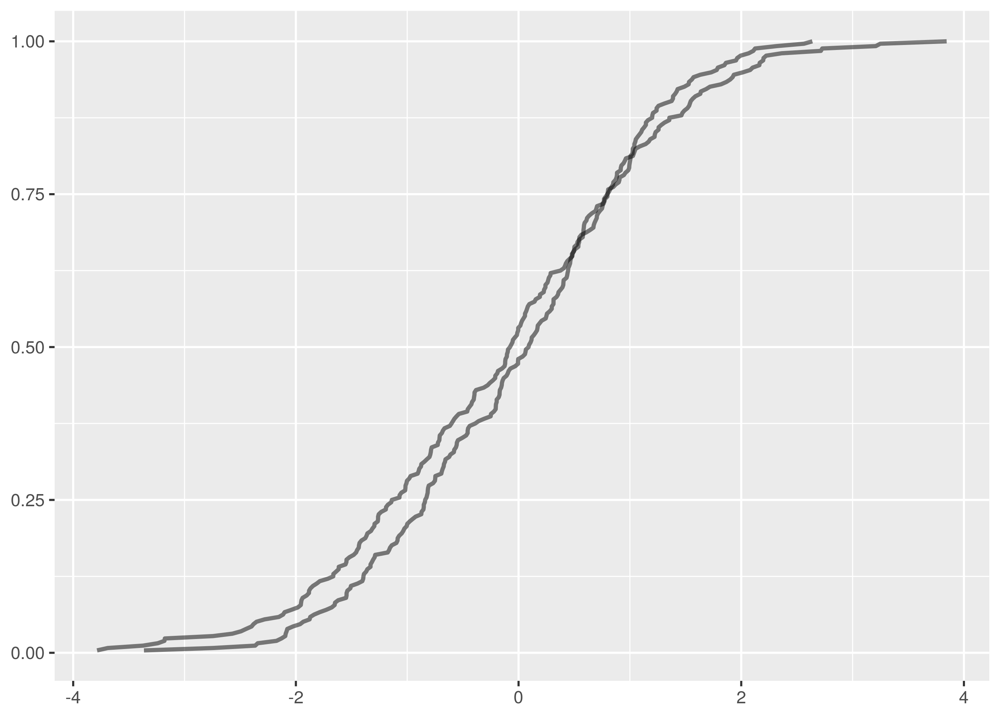

The problem, however, is a lack of samples combined with the weakness of the
Kolmogorov-Smirnov test in detecting differences in spread at the tails. Both of
these datasets have 256 samples and the critical value for 95% confidence is
0.1186. This is a large difference to demonstrate at the edges of the empirical
cumulative distribution functions and in the case of this test the :math:`D`
test statistic is a comfortable 0.082.

There is insufficient evidence to reject the null hypothesis.

Let's also examine the false positive test where the rejection probability is
tied highest, between ``dat/normal_0_1.4.tsv`` and ``dat/normal_0_2.1.tsv``.

::

    $ cargo run -q --bin ks_f64 dat/normal_0_1.4.tsv dat/normal_0_2.1.tsv
    Samples are from the same distribution.
    test statistic = 0.1171875
    critical value = 0.11867932230234146
    reject probability = 0.9451734528250557

.. image:: images/n014n021-1.png
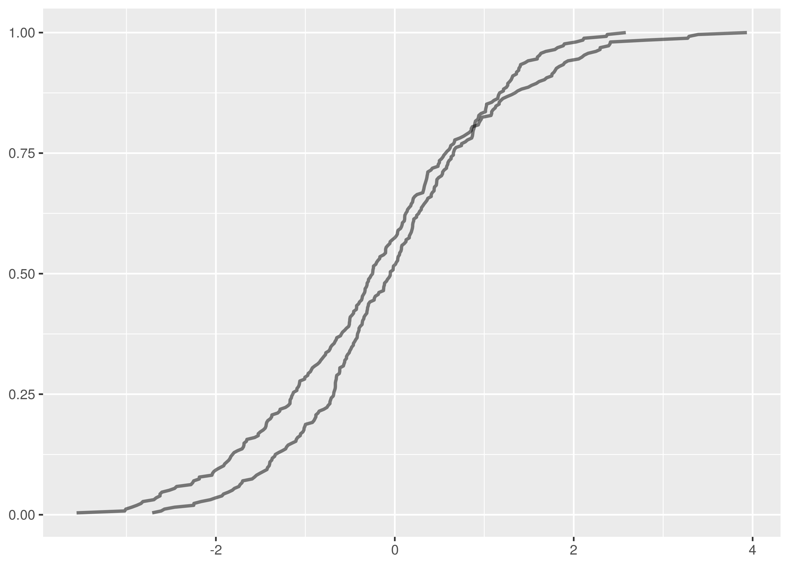

This is just incredibly borderline. There is very strong difference on the left
side but it falls fractionally short of the required confidence level. Note how
this also illustrates the bias in favour of the null hypothesis that the two
samples are from the same distribution.

Notice that of the false positives, only the one between
``dat/normal_0_1.2.tsv`` and ``dat/normal_0_2.tsv`` happens with a dataset
containing more than 256 samples. In this test with 8192 samples against 256,
the critical value is 0.0855 and the test statistic scrapes by underneath at
0.08288.

In the case for two samples of size 8192, the critical value is a very
discriminating 0.02118.

In total there are ten false positives in 75 tests, a poor showing.

The lesson is that false positives are more common and especially with small
datasets. When using the Kolmogorov-Smirnov test in production systems, tend to
use higher confidence levels when larger datasets cannot be available.

http://twitter.com Response Times
~~~~~~~~~~~~~~~~~~~~~~~~~~~~~~~~~
Less artificially, and more representative of metrics in software operations and
monitoring, are datasets of HTTP server response times. Metrics which behave
like response time are very typical and not easy to analyse with usual
statistical technology.

`Apache Bench`_ is a commandline URL loadtesting tool that can be used to
collect sample datasets of HTTP request times. A dataset of service times for
``http://twitter.com`` was collected using:

.. _Apache Bench: https://httpd.apache.org/docs/2.2/programs/ab.html

.. sourcecode:: bash

    ab -n 8192 -c 1 -v 3 -g http.tsv http://twitter.com/

The test actually ships 3.36MB of redirect headers since ``http://twitter.com``
is a 301 Moved Permanently redirect to ``https://twitter.com`` but the dataset
is still useful as it exhibits the behaviour of HTTP endpoint responses anyway.

The options in the call specify:

* ``-c 1``: Use test concurrency of one outstanding request to throttle the
  testing.
* ``-v 3``: Log at high verbosity level to show individual request data.
* ``-g http.tsv``: Output a TSV summary to ``http.tsv``. The ``-g`` stands for
  Gnuplot which the output file is organised to support particularly.

A timeout or significant failure can trash the test completely, so it is more
robust to collect data in blocks of 256 requests and combine the results. This
was done in collect some supplementary data for comparison purposes and is
available as ``dat/http.1.tsv`` through ``dat/http.4.tsv`` in the
`Github repository <https://github.com/daithiocrualaoich/kolmogorov_smirnov>`_.
The primary dataset is ``dat/http.tsv``.

.. sourcecode:: bash

    for i in {1..32}
    do
      ab -n 256 -c 1 -v 3 -g http.$i.tsv http://twitter.com/
    done

Aside: The trailing ``/`` in the target URL is required in the ``ab`` command or
it fails with an invalid URL error.

The result data file from Apache Bench has the following
`schema <http://stackoverflow.com/a/6143973>`_:

* ``starttime``: A human friendly time representation of the request start.
* ``seconds``: The Unix epoch seconds timestamp of ``starttime``. This is the
  number of regular, but not leap, seconds since 1 January 1970. Trivia Fact:
  this is why Unix timestamps line up, against sane expectations, on minute
  boundaries when divided by 60.
* ``ctime``: Connection time to the server in milliseconds.
* ``dtime``: Processing time on the server in milliseconds. The ``d`` may stand
  for "duration" or it may not.
* ``ttime``: Total time in milliseconds, ``ctime + dtime``.
* ``wait``: Waiting time in milliseconds. This is not included in ``ttime``, it
  appears from the data.

If you want to use the generated data file as it was intended for processing
with Gnuplot, then see this
`article <http://www.bradlanders.com/2013/04/15/apache-bench-and-gnuplot-youre-probably-doing-it-wrong>`_.

The output data is sorted by Apache Bench according to ``ttime``, meaning
shorter requests come first in the output. The purposes here better appreciate
data sorted by the ``seconds`` timestamp, particularly to plot the timeseries
data in the order the requests were issued.

And because nobody is much interested in when exactly this dataset was made, the
``starttime`` and ``seconds`` fields are dropped from the final data. The
following `crafty piece of Awk <http://unix.stackexchange.com/a/71949>`_ does
the header-retaining sort and column projection.

.. sourcecode:: bash

    cat http.tsv |\
      awk 'NR == 1; NR > 1 {print $0 | "sort"}' |\
      cut -f3- \
      > http.tsv.out

All the response time datasets in the Github repository have been processed like
this.

To transform the headered multi-column data files into a format suitable for
input to ``ks_i64`` use the following example as a guide:

.. sourcecode:: bash

    tail -n +2 http.tsv |\
      cut -f3 \
      > http_ttime.tsv

Then to run the test:

.. sourcecode:: bash

    cargo run -q --bin test_t64 dat/http_ttime.tsv dat/http_ttime.1.tsv

The timeseries plot shows a common Internet story of outliers, failure cases and
disgrace.

.. image:: images/http-timeseries-1.png

The density is highly peaked but includes fast failure weight and a long light
tail. This is not straightforward to parametrise with the common statistical
distributions that are fruitful to work with and demonstrates the significant
utility of the Kolmogorov-Smirnov test.

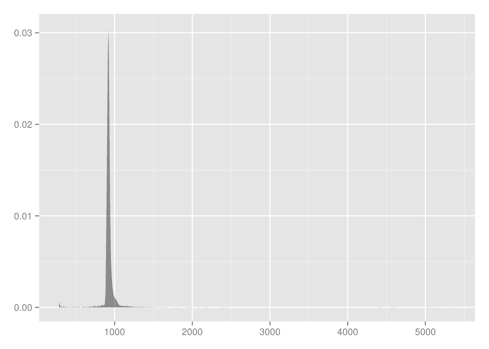

Note there is a much larger horizontal axis range in this graph. This has the
effect of compressing the visual area under the graph relative to the earlier
dataset density plots.

Don't let this trick you. The y axis values are smaller than in the other graphs
but there is far more horizontal axis support to compensate. The definition of a
probability density means the area under the graph in all the density plots must
sum to the same.

Results
```````
Restricting attention to just the total time value, there are ten test dataset
combinations all of which are false negatives save for the comparison between
``dat/http_ttime.1.tsv`` ``dat/http_ttime.4.tsv``

.. sourcecode:: bash

    for I in dat/http_ttime.*
    do
        for J in dat/http_ttime.*
        do
            if [[ "$I" < "$J" ]]
            then
                echo $I $J
                cargo run -q --bin ks_f64 $I $J
                echo
                echo
            fi
        done
    done

The only accepted test returned the following test information:

::

    $ cargo run -q --bin ks_f64 dat/http_ttime.1.tsv dat/http_ttime.4.tsv
    Samples are from the same distribution.
    test statistic = 0.0703125
    critical value = 0.11867932230234146
    reject probability = 0.4633497077833878

Here is the timeseries and density plot for ``ttime`` in the
``dat/http_ttime.1.tsv`` dataset for comparison to the ``dat/http_ttime.tsv``
plots above.

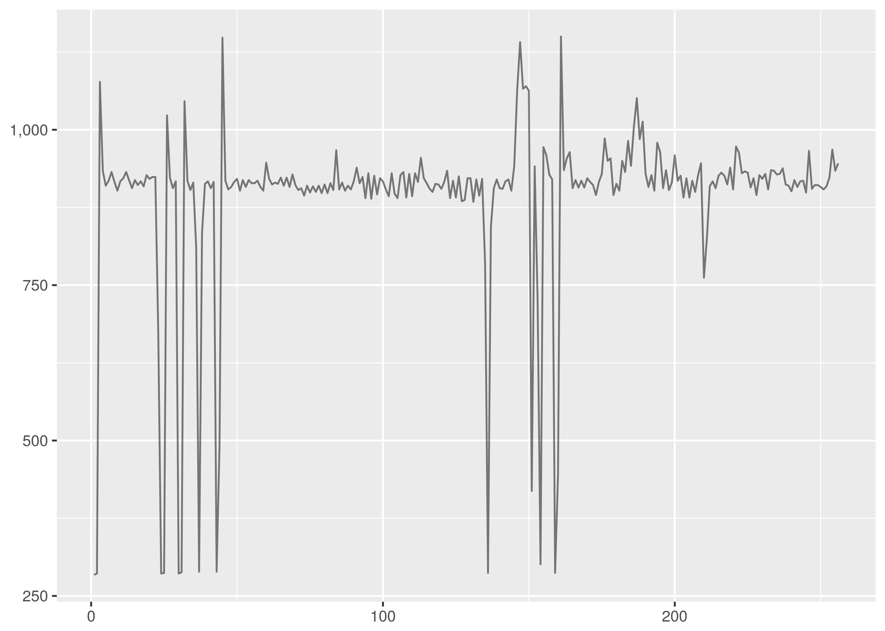
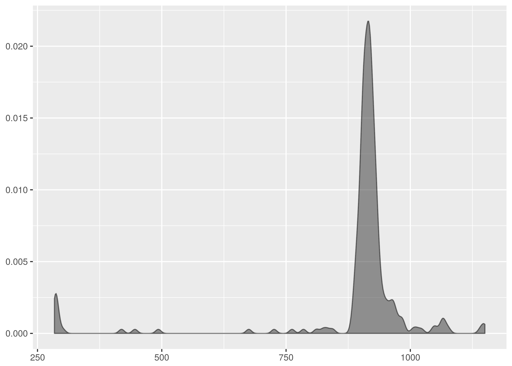

There is some similarity to the observations in ``dat/http_ttime.tsv`` but there
is a far shorter tail here.

In fact, the datasets are all very different from each other. Here are the other
density plots.

``dat/http_ttime.2.tsv`` exhibits a spike of failures which are of short
duration and contribute large weight on the left of the graph.

.. image:: images/http2-density-1.png

By contrast ``dat/http_ttime.3.tsv`` has no fast failures or slow outliners and
the weight is packed around .9s to 1s.

.. image:: images/http3-density-1.png

``dat/http_ttime.4.tsv`` has a long tail for an outliers, likely to be request
timeouts.

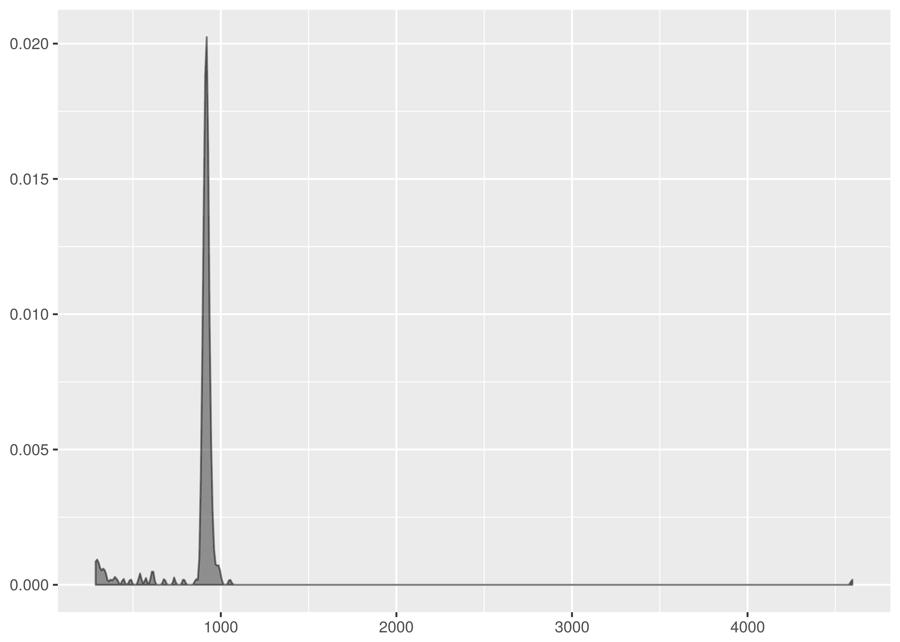

By inspection of the empirical cumulative density functions, the only test with
a possible chance of accepting the null hypothesis was that between
``dat/http_ttime.tsv`` and ``dat/http_ttime.4.tsv``. This is the comparison with
the smallest test statistic from the rejected cases.

::

    $ cargo run -q --bin ks_f64 dat/http_ttime.4.tsv dat/http_ttime.tsv
    Samples are from different distributions.
    test statistic = 0.1368408203125
    critical value = 0.08550809323787689
    reject probability = 0.9998422018223175

Even still, this is not a close match. The empirical cumulative density function
plots show very different profiles on the error request times to the left of the
diagram.

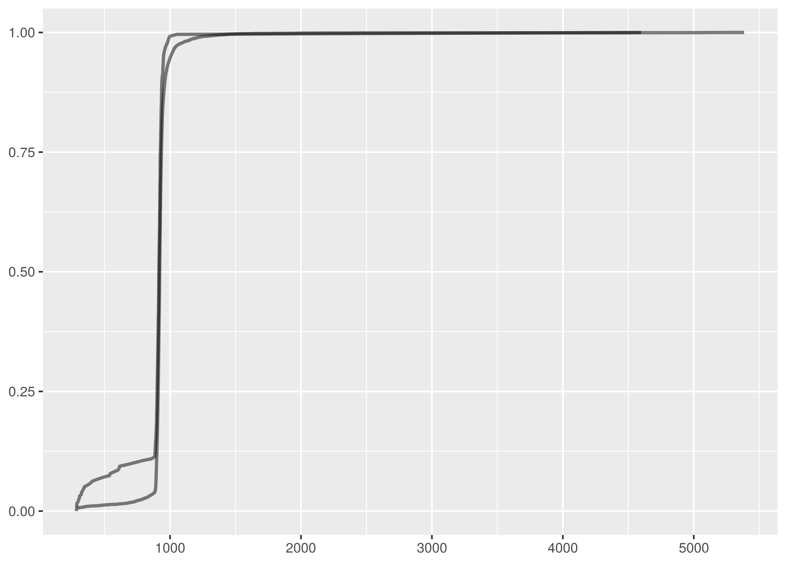

As for the passing match, it turns out that ``dat/http_ttime.1.tsv`` and
``dat/http_ttime.4.tsv`` are indeed quite similar. This would be more apparent
but for the outlier in ``dat/http_ttime.4.tsv``. Given that the
Kolmogorov-Smirnov test is not sensitive at the tails, this does not contribute
evidence to reject the null hypothesis.

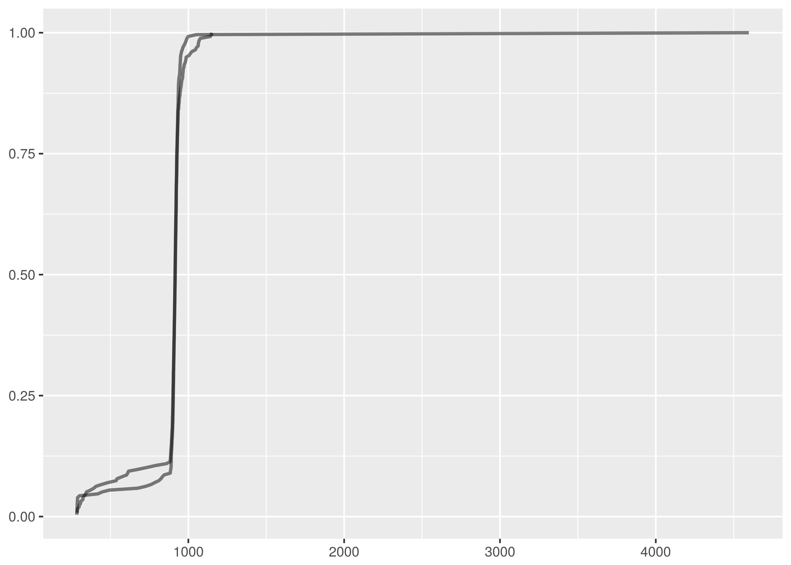

In conclusion, the captured HTTP response time datasets exhibit features which
make them likely to actually be from different distributions, some with and
without long outliers, fast errors.

Twitter, Inc. Stock Price
~~~~~~~~~~~~~~~~~~~~~~~~~
The final dataset is a historical stock market sample. Collect a fortnight of
minute granularity stock price data from Google Finance using:

.. sourcecode:: bash

    wget -O twtr.dat 'http://www.google.com/finance/getprices?i=60&p=14d&f=d,c,h,l,o,v&q=TWTR'

The HTTP parameters in the call specify:

* ``i=60``: This is the sample interval in seconds, i.e. get per-minute data.
  The minimum sample interval available is sixy seconds.
* ``p=14d``: Return data for the previous fourteen days.
* ``f=d,c,h,l,o,v``: Include columns in the result for sample interval start
  date, closing price, high price value, low price value, opening price, and
  trade count, i.e. volume.
* ``q=TWTR``: Query data for the TWTR stock symbol.

The response includes a header block before listing the sample data which looks
like the following:

::

    a1448289000,26.11,26.11,26.11,26.11,500
    1,26.17,26.17,26.12,26.13,700
    2,26.25,26.25,26.14,26.14,191266
    3,26.14,26.27,26.13,26.21,89148
    4,26.01,26.15,26.01,26.135,36535

Lines starting with an ``a`` character include an absolute timestamp value.
Otherwise, the timestamp field value is an offset and has to be added to the
timestamp value in the last previous absolute timestamp line to get the
absolute timestamp for the given line.

This Awk script truncates the header block and folds the timestamp offsets into
absolute timestamp values.

.. sourcecode:: bash

    tail +8 twtr.dat | awk '
      BEGIN {
        FS=","; OFS="\t"
        print "timestamp","close","high","low","open","volume"
      } {
        if (substr($1,0,1) == "a") {
          $1 = substr($1,2)
          base = 0 + $1
        } else {
          $1 = base + (60 * $1)
        }

        print $0
      }' > twtr.tsv

The output TSV file is provided as ``dat/twtr.tsv`` in the
`Github repository <https://github.com/daithiocrualaoich/kolmogorov_smirnov>`_.

A supplementary dataset consisting of a single day was collected for comparison
purposes and is available as ``dat/twtr.1.tsv``. It was processed in the same
manner as ``dat/twtr.tsv``. The collection command was:

.. sourcecode:: bash

    wget -O twtr.1.dat 'http://www.google.com/finance/getprices?i=60&p=1d&f=d,c,h,l,o,v&q=TWTR'

Trading hours on the New York Stock Exchange are weekdays 9.30am to 4pm. This
results in long horizontal line segments for missing values in the timeseries
plot for interval opening prices, corresponding to the overnight and weekend
market close periods.

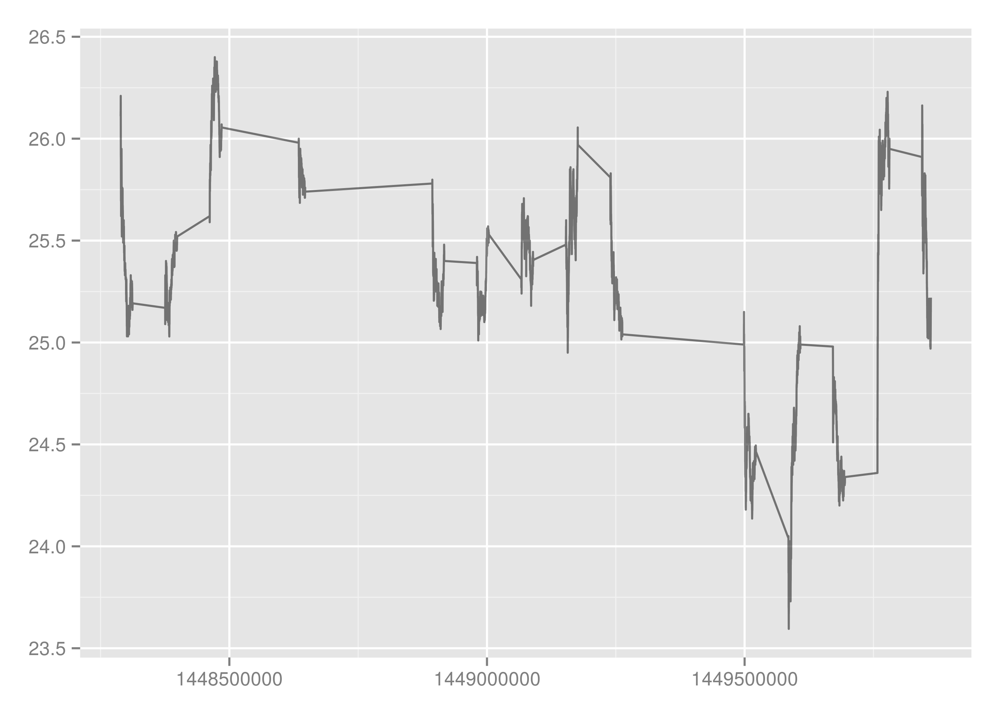

The following is the minutely opening price density plot.

.. image:: images/twtr-open-density-1.png

The missing value graph artifact is more pronounced in the minutely trading
volume timeseries. The lines joining the trading day regions should be
disregarded.

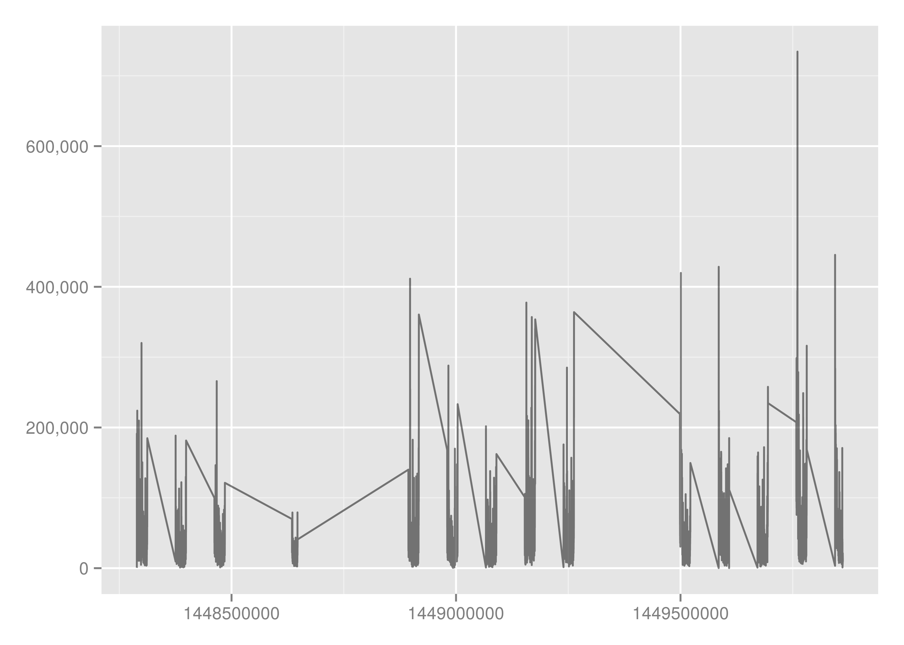

Finally, the trading volume density plot is very structured, congregating near
the 17,000 trades/minute rate.

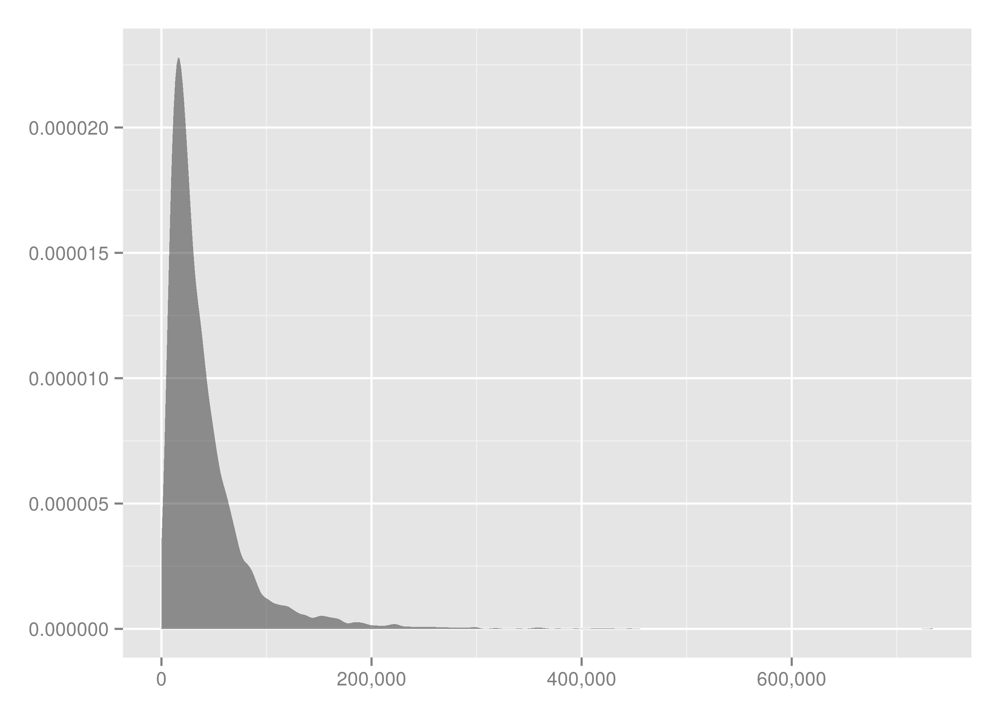

Results
```````
The reader is invited to analyse the share price as an exercise. Let me know
from your expensive yacht if you figure it out and make a fortune.


A Diversion In QuickCheck
-------------------------
`QuickCheck`_ is crazy amounts of fun writing tests and a great way to become
comfortable in a new language.

.. _QuickCheck: https://en.wikipedia.org/wiki/QuickCheck

The idea in QuickCheck is to write tests as properties of inputs rather than
specific test cases. So, for instance, rather than checking whether a given
pair of samples have a determined maximum empirical cumulative distribution
function distance, instead a generic property is verified. This property can be
as simple as the distance is between zero and one for any pair of input samples
or as constrictive as the programmer is able to create.

This form of test construction means QuickCheck can probabilistically check the
property over a huge number of test case instances and establish a much greater
confidence of correctness than a single individual test instance could.

It can be harder too, yes. Writing properties that tightly specify the desired
behaviour is difficult but starting with properties that very loosely constrain
the software behaviour is often helpful, facilitating an evolution into more
sharply binding criteria.

For a tutorial introduction to QuickCheck, John Hughes has a great
`introduction talk <https://www.youtube.com/watch?v=zi0rHwfiX1Q>`_.

There is an implementation of `QuickCheck for Rust`_ and the tests for the
Kolmogorov-Smirnov Rust library have been implemented using it. See the
`Github repository <https://github.com/daithiocrualaoich/kolmogorov_smirnov>`_
for examples of how to QuickCheck in Rust.

.. _QuickCheck for Rust: https://github.com/BurntSushi/quickcheck

Here is a toy example of a QuickCheck property to test an integer doubling
function.

.. sourcecode:: rust

    extern crate quickcheck;
    use self::quickcheck::quickcheck;

    fn double(n: u32) -> u32 {
        2 * n
    }

    #[test]
    fn test_double_n_is_greater_than_n() {
        fn prop(n: u32) -> bool {
            double(n) > n
        }

        quickcheck(prop as fn(u32) -> bool);
    }

This test is broken and QuickCheck makes short(I almost wrote 'quick'!) work of
letting us know that we have been silly.

::

    test tests::test_double_n_is_greater_than_n ... FAILED

    failures:

    ---- tests::test_double_n_is_greater_than_n stdout ----
        thread 'tests::test_double_n_is_greater_than_n' panicked at '[quickcheck] TEST FAILED. Arguments: (0)', /root/.cargo/registry/src/github.com-0a35038f75765ae4/quickcheck-0.2.24/src/tester.rs:113

The last log line includes the ``u32`` value that failed the test, i.e. zero.
Correct practice is to now create a non-probabilistic test case that tests this
specific value. This protects the codebase from regressions in the future.

The problem in the example is that the property is not actually valid for the
``double`` function because double zero is not actually greater than zero. So
let's fix the test.

.. sourcecode:: rust

    #[test]
    fn test_double_n_is_geq_n() {
        fn prop(n: u32) -> bool {
            double(n) >= n
        }

        quickcheck(prop as fn(u32) -> bool);
    }

Note also how QuickCheck produced a minimal test violation, there are no smaller
values of ``u32`` that violated the test. This is not an accident, QuickCheck
libraries often include features for shrinking test failures to minimal
examples. When a test fails, QuickCheck will often rerun it searching
successively on smaller instances of the test arguments to determine the
smallest violating test case.

The function is still broken, by the way, because it overflows for large input
values. The Rust QuickCheck doesn't catch this problem because the
``QuickCheck::quickcheck`` convenience runner configures the tester to produce
random data between zero and one hundred, not in the range where the overflow
will be evident. For this reason, you should not use the convenience runner in
testing. Instead, configure the ``QuickCheck`` manually with as large a random
range as you can.

.. sourcecode:: rust

    extern crate rand;
    use self::quickcheck::{QuickCheck, StdGen, Testable};
    use std::usize;

    fn check<A: Testable>(f: A) {
        let gen = StdGen::new(rand::thread_rng(), usize::MAX);
        QuickCheck::new().gen(gen).quickcheck(f);
    }

    #[test]
    fn test_double_n_is_geq_n() {
        fn prop(n: u32) -> bool {
            double(n) >= n
        }

        check(prop as fn(u32) -> bool);
    }

This will break the test with an overflow panic. This is correct and the
``double`` function should be reimplemented to do something about handling
overflow properly.

A warning, though, if you are testing ``vec`` or string types. The number of
elements in the randomly generated ``vec`` or equivalently, the length of the
generated string will be between zero and the size in the ``StdGen`` configured.
There is the potential in this to create unnecessarily huge ``vec`` and string
values. See the example of ``NonEmptyVec`` below for a technique to limit the
size of a randomly generated ``vec`` or string while still using ``StdGen`` with
a large range.

Unfortunately, you are out of luck on a 32-bit machine where the ``usize::MAX``
will only get you to sampling correctly in ``u32``. You will need to upgrade to
a new machine before you can test ``u64``, sorry.

By way of example, it is actually more convenient to include known failure cases
like ``u32::max_value()`` in the QuickCheck test function rather than in a
separate traditional test case function. So, when the QuickCheck fails for the
overflow bug, add the test case like follows instead of as a new function:

.. sourcecode:: rust

    #[test]
    fn test_double_n_is_geq_n() {
        fn prop(n: u32) -> bool {
            double(n) >= n
        }

        assert!(prop(u32::max_value()));
        quickcheck(prop as fn(u32) -> bool);
    }

Sometimes the property to test is not valid on some test arguments, i.e. the
property is useful to verify but there are certain combinations of
probabilistically generated inputs that should be excluded.

The Rust QuickCheck library supports this with ``TestResult``. Suppose that
instead of writing the ``double`` test property correctly, we wanted to just
exclude the failing cases instead. This might be a practical thing to do in
a real scenario and we can rewrite the test as follows:

.. sourcecode:: rust

    use self::quickcheck::TestResult;

    #[test]
    fn test_double_n_is_greater_than_n_if_n_is_greater_than_1() {
        fn prop(n: u32) -> TestResult {
            if n <= 1 {
                return TestResult::discard()
            }

            let actual = double(n);

            TestResult::from_bool(actual > n)
        }

        quickcheck(prop as fn(u32) -> TestResult);
    }

Here, the cases where the property legimately doesn't hold are excluded by
returning``TestResult::discard()``. This causes QuickCheck to retry the test
with the next randomly generated value instead.

Note also that the function return type is now ``TestResult`` and that
``TestResult::from_bool`` is needed for the test condition.

An alternative approach is to create a wrapper type in the test code which only
permits valid input and to rewrite the tests to take this type as the
probabilistically generated input instead.

For example, suppose you want to ensure that QuickCheck only generates positive
integers for use in your property verification. You add a wrapper type
``PositiveInteger`` and now in order for QuickCheck to work, you have to
implement the ``Arbitrary`` trait for this new type.

The minimum requirement for an ``Arbitrary`` implementation is a function called
``arbitrary`` taking a ``Gen`` random generator and producing a random
``PositiveInteger``. New implementations should always leverage existing
``Arbitrary`` implementations, and so ``PositiveInteger`` generates a random
``u64`` using ``u64::arbitrary()`` and constrains it to be greater than zero.

.. sourcecode:: rust

    extern crate quickcheck;
    use self::quickcheck::{Arbitrary, Gen};
    use std::cmp;

    #[derive(Clone, Debug)]
    struct PositiveInteger {
        val: u64,
    }

    impl Arbitrary for PositiveInteger {
        fn arbitrary<G: Gen>(g: &mut G) -> PositiveInteger {
            let val = cmp::max(u64::arbitrary(g), 1);
            PositiveInteger { value: val }
        }

        fn shrink(&self) -> Box<Iterator<Item = PositiveInteger>> {
            let shrunk: Box<Iterator<Item = u64>> = self.value.shrink();
            Box::new(shrunk.filter(|&v| v > 0).map(|v| {
                PositiveInteger { value: v }
            }))
        }
    }

Note also the implementation of ``shrink()`` here, again in terms of an
existing ``u64::shrink()``. This method is optional and unless implemented
QuickCheck will not minimise property violations for the new wrapper type.

Use ``PositiveInteger`` like follows:

.. sourcecode:: rust

    use self::quickcheck::quickcheck;

    fn square(n: u64) -> u64 {
        n * n
    }

    #[test]
    fn test_square_n_for_positive_n_is_geq_1() {
        fn prop(n: PositiveInteger) -> bool {
            square(n.value) >= 1
        }

        quickcheck(prop as fn(PositiveInteger) -> bool);
    }

There is no need now for ``TestResult::discard()`` to ignore the failure case
for zero.

Finally, wrappers can be added for more complicated types too. A commonly
useful container type generator is ``NonEmptyVec`` which produces a random
``vec`` of the parameterised type but excludes the empty ``vec`` case. The
generic type must itself implement ``Arbitrary`` for this to work.

.. sourcecode:: rust

    extern crate quickcheck;
    extern crate rand;
    use self::quickcheck::{quickcheck, Arbitrary, Gen};
    use self::rand::Rng;
    use std::cmp;

    #[derive(Debug, Clone)]
    struct NonEmptyVec<A> {
        value: Vec<A>,
    }

    impl<A: Arbitrary> Arbitrary for NonEmptyVec<A> {
        fn arbitrary<G: Gen>(g: &mut G) -> NonEmptyVec<A> {
            // Limit size of generated vec to 1024
            let max = cmp::min(g.size(), 1024);

            let size = g.gen_range(1, max);
            let vec = (0..size).map(|_| A::arbitrary(g)).collect();

            NonEmptyVec { value: vec }
        }

        fn shrink(&self) -> Box<Iterator<Item = NonEmptyVec<A>>> {
            let vec: Vec<A> = self.value.clone();
            let shrunk: Box<Iterator<Item = Vec<A>>> = vec.shrink();

            Box::new(shrunk.filter(|v| v.len() > 0).map(|v| {
                NonEmptyVec { value: v }
            }))
        }
    }

    #[test]
    fn test_head_of_sorted_vec_is_smallest() {
        fn prop(vec: NonEmptyVec<u64>) -> bool {
            let mut sorted = vec.value.clone();
            sorted.sort();

            // NonEmptyVec must have an element.
            let head = sorted[0];

            vec.value.iter().all(|&n| head <= n)
        }

        quickcheck(prop as fn(NonEmptyVec<u64>) -> bool);
    }
